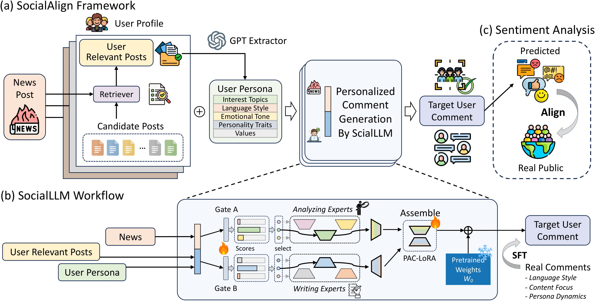

# SocialAlign

This repo is the implementation of paper [*From Individuals to Crowds: Dual-Level Public Response Prediction in Social Media*](https://arxiv.org/pdf/2508.00497).

## Overview
*SocialAlign* is the first unified framework designed to predicts real-world responses
at both micro and macro levels in social contexts.
Our framework employs SocialLLM with an articulate Personalized Analyze-Compose LoRA (PAC-LoRA) structure, which deploys specialized expert modules for content analysis and response generation across diverse topics and user profiles, enabling the generation of personalized comments with corresponding sentiments.
Experimental results demonstrates that SocialAlign surpasses strong baselines, enhancing public response prediction accuracy in both micro and macro levels while effectively capturing sentiment trends on social media.



## Project Structure
- `data_collection` includes three subprojects for crawling Weibo data. 
    - `weibo-ai-search` is used for crawling posts from [Weibo AI Search](https://ai.s.weibo.com/) URL. As the timestamp of detailed page in Weibo AI Search remains changing, you need to specify a URL of detailed page to be crawled. Run:
    ```bash
    cd data_collection/weibo-ai-search
    python run_spider.py --url "the url you would like to crawl" --output "OUTPUT_FILE_PATH"
    ```

    - `weibo-search` is used to crawl search results of Weibo. Set your cookie of Weibo and put the trending hashtags you would like to search [here](./data_collection/weibo-search/weibo/settings.py), and then execute [run_spider.py](./data_collection/weibo-search/run_spider.py).

    - `weibo-crawler` is to crawl history post for each user. [collect_user_history_4_ai_search.py](./data_collection/weibo-crawler/collect_user_history_4_ai_search.py) and [collect_user_history_infos.py](./data_collection/weibo-crawler/collect_user_history_infos.py) are the scripts for `weibo-ai-search` and `weibo-search` respectively.
- `dataset_construction` contains the code for constructing our *SocialWeibo* dataset.
- `modeling_pac_lora` is the implementation of *PAC-LoRA*, along with the modified Qwen2 model in order to adapt it to our *PAC-LoRA* architecture and task. [pac_lora_layer.py](./modeling_pac_lora/pac_lora_layer.py) is based on `peft 0.12` and another two scripts are based on `transformers 4.46`.
- `fine-tuning` includes the scripts for fine-tuning our *SocialLLM* and some baseline models.
- `inference` includes code to infer baselines and our *SocialLLM*.
- `utils` contains some utility functions used in our project.
  
**We would release all code after notification.**
## Getting Started
### Installation
clone our repo and execute `pip install -r requirements.txt` to install the requirements needed.
### Data Collection
Your can collect hashtagged posts discussing social events through two channals: Weibo Search and Weibo AI Search. `weibo-crawler` can be utilized to collect user history posts for each unique user appeared in the crawled posts with hashtag.
### Dataset Construction
The pipeline of *SocialWeibo* dataset construction begins with organizing a raw dataset, in which we would remove low-quality user historical posts, clean text noise and then retrieve relevant posts for each user according to the given news content. For example, you may refer to [this](./dataset_construction/organize_dataset.py) to construct raw dataset when using Weibo Search as the data source.

After obtaining the raw dataset, we would extract user persona for each user according to the given user historical posts [here](./dataset_construction/extract_user_persona.py). Please set your OpenAI API Key before extracting user personas:

```export OPENAI_API_KEY="your_openai_api_key"```

and then construct *SocialWeibo* through [organize_alphca_dataset.py](./dataset_construction/organize_alphca_dataset.py). Our dataset is in alphca format.
### Fine-tuning
Please install our **pac-peft** and **pac-transformers** libraries in the environment by changing into the two folders and run `pip install -e .` respectively.


Then, run the script `fine_tuning/fine_tune_pac_lora.py` to fine-tuning.

### Inference
After obtaining the PAC-LoRA weights, you can perform inference on the test set using [infer_socialLLM.py](./inference/infer_socialLLM.py).

Moreover, you do not need to merge weights, as the assembly of multi-analyzing and writing  experts is dynamic.

## Citation
If you find our work is useful for your research or applications, please kindly cite us:
```
@inproceedings{10.1145/3746027.3754828,
author = {Zhang, Jinghui and Wan, Kaiyang and Xu, Longwei and Li, Ao and Liu, Zongfang and Chen, Xiuying},
title = {From Individuals to Crowds: Dual-Level Public Response Prediction in Social Media},
year = {2025},
isbn = {9798400720352},
publisher = {Association for Computing Machinery},
address = {New York, NY, USA},
url = {https://doi.org/10.1145/3746027.3754828},
doi = {10.1145/3746027.3754828},
booktitle = {Proceedings of the 33rd ACM International Conference on Multimedia},
pages = {5903–5912},
numpages = {10},
location = {Dublin, Ireland},
series = {MM '25}
}
```

## Acknowledgement
1. `weibo-search` and `weibo-crawler` in `data_collection` are based on the two projects, respectively:
   - [weibo-search](https://github.com/dataabc/weibo-search)
   - [weibo-crawler](https://github.com/dataabc/weibo-crawler)
2. The implementation of our *PAC-LoRA* structure is based on Huggingface [Transformers](https://github.com/huggingface/transformers) and [PEFT](https://github.com/huggingface/peft) libraries.
